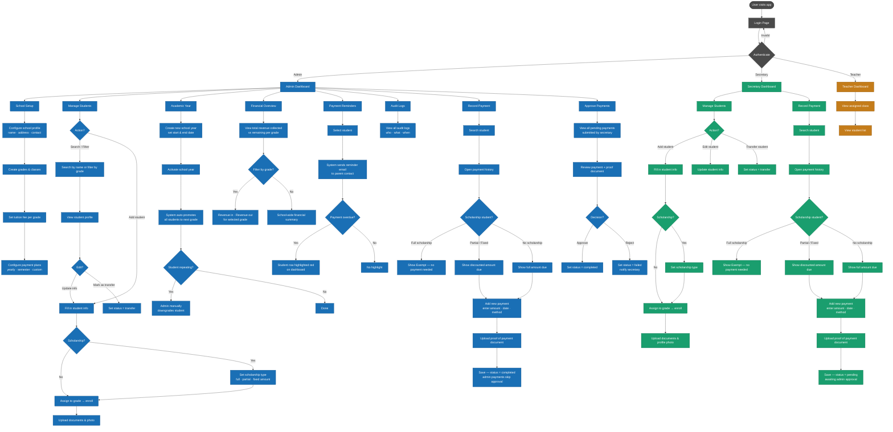

```mermaid
flowchart TD
    START([User visits app]) --> LOGIN[Login Page]
    LOGIN --> AUTH{Authenticate}
    AUTH -->|Invalid| LOGIN
    AUTH -->|Admin| ADMIN_DASH[Admin Dashboard]
    AUTH -->|Secretary| SEC_DASH[Secretary Dashboard]
    AUTH -->|Teacher| TEACHER_DASH[Teacher Dashboard]

    %% ── ADMIN FLOWS ──────────────────────────────────────────

    ADMIN_DASH --> A1[School Setup]
    ADMIN_DASH --> A2[Manage Students]
    ADMIN_DASH --> A3[Academic Year]
    ADMIN_DASH --> A4[Financial Overview]
    ADMIN_DASH --> A5[Payment Reminders]
    ADMIN_DASH --> A6[Audit Logs]

    A1 --> A1a[Configure school profile\nname · address · contact]
    A1a --> A1b[Create grades & classes]
    A1b --> A1c[Set tuition fee per grade]
    A1c --> A1d[Configure payment plans\nyearly · semester · custom]

    A2 --> A2a{Action?}
    A2a -->|Search / Filter| A2b[Search by name or filter by grade]
    A2b --> A2c[View student profile]
    A2a -->|Add student| A2d[Fill in student info]
    A2d --> A2e{Scholarship?}
    A2e -->|No| A2f[Assign to grade → enroll]
    A2e -->|Yes| A2g[Set scholarship type\nfull · partial · fixed amount]
    A2g --> A2f
    A2f --> A2h[Upload documents & photo]

    A2c --> A2i{Edit?}
    A2i -->|Update info| A2d
    A2i -->|Mark as transfer| A2j[Set status = transfer]

    A3 --> A3a[Create new school year\nset start & end date]
    A3a --> A3b[Activate school year]
    A3b --> A3c[System auto-promotes\nall students to next grade]
    A3c --> A3d{Student repeating?}
    A3d -->|Yes| A3e[Admin manually\ndowngrades student]
    A3d -->|No| A3f[Done]

    A4 --> A4a[View total revenue collected\nvs remaining per grade]
    A4a --> A4b{Filter by grade?}
    A4b -->|Yes| A4c[Revenue in · Revenue out\nfor selected grade]
    A4b -->|No| A4d[School-wide financial summary]

    A5 --> A5a[Select student]
    A5a --> A5b[System sends reminder email\nto parent contact]
    A5b --> A5c{Payment overdue?}
    A5c -->|Yes| A5d[Student row highlighted red\non dashboard]
    A5c -->|No| A5e[No highlight]

    A6 --> A6a[View all audit logs\nwho · what · when]

    ADMIN_DASH --> A7[Record Payment]
    ADMIN_DASH --> A8[Approve Payments]

    A7 --> A7a[Search student]
    A7a --> A7b[Open payment history]
    A7b --> A7c{Scholarship student?}
    A7c -->|Full scholarship| A7d[Show Exempt — no payment needed]
    A7c -->|Partial / Fixed| A7e[Show discounted amount due]
    A7c -->|No scholarship| A7f[Show full amount due]
    A7e --> A7g[Add new payment\nenter amount · date · method]
    A7f --> A7g
    A7g --> A7h[Upload proof of payment document]
    A7h --> A7i[Save — status = completed\nadmin payments skip approval]

    A8 --> A8a[View all pending payments\nsubmitted by secretary]
    A8a --> A8b[Review payment + proof document]
    A8b --> A8c{Decision?}
    A8c -->|Approve| A8d[Set status = completed]
    A8c -->|Reject| A8e[Set status = failed\nnotify secretary]

    %% ── SECRETARY FLOWS ──────────────────────────────────────

    SEC_DASH --> S1[Manage Students]
    SEC_DASH --> S2[Record Payment]

    S1 --> S1a{Action?}
    S1a -->|Add student| S1b[Fill in student info]
    S1b --> S1c{Scholarship?}
    S1c -->|No| S1d[Assign to grade → enroll]
    S1c -->|Yes| S1e[Set scholarship type]
    S1e --> S1d
    S1d --> S1f[Upload documents & profile photo]
    S1a -->|Edit student| S1g[Update student info]
    S1a -->|Transfer student| S1h[Set status = transfer]

    S2 --> S2a[Search student]
    S2a --> S2b[Open payment history]
    S2b --> S2c{Scholarship student?}
    S2c -->|Full scholarship| S2d[Show Exempt — no payment needed]
    S2c -->|Partial / Fixed| S2e[Show discounted amount due]
    S2c -->|No scholarship| S2f[Show full amount due]
    S2e --> S2g[Add new payment\nenter amount · date · method]
    S2f --> S2g
    S2g --> S2h[Upload proof of payment document]
    S2h --> S2i[Save — status = pending\nawaiting admin approval]

    %% ── TEACHER FLOWS ─────────────────────────────────────────

    TEACHER_DASH --> T1[View assigned class]
    T1 --> T2[View student list]

    %% ── COLORS ───────────────────────────────────────────────

    classDef shared    fill:#4a4a4a,stroke:#222,color:#fff
    classDef admin     fill:#1a6fb5,stroke:#0d4a80,color:#fff
    classDef secretary fill:#1a9e6e,stroke:#0d6b4a,color:#fff
    classDef teacher   fill:#c47c1a,stroke:#8a5510,color:#fff

    class START,LOGIN,AUTH shared

    class ADMIN_DASH,A1,A1a,A1b,A1c,A1d admin
    class A2,A2a,A2b,A2c,A2d,A2e,A2f,A2g,A2h,A2i,A2j admin
    class A3,A3a,A3b,A3c,A3d,A3e,A3f admin
    class A4,A4a,A4b,A4c,A4d admin
    class A5,A5a,A5b,A5c,A5d,A5e admin
    class A6,A6a admin
    class A7,A7a,A7b,A7c,A7d,A7e,A7f,A7g,A7h,A7i admin
    class A8,A8a,A8b,A8c,A8d,A8e admin

    class SEC_DASH,S1,S1a,S1b,S1c,S1d,S1e,S1f,S1g,S1h secretary
    class S2,S2a,S2b,S2c,S2d,S2e,S2f,S2g,S2h,S2i secretary

    class TEACHER_DASH,T1,T2 teacher
```
