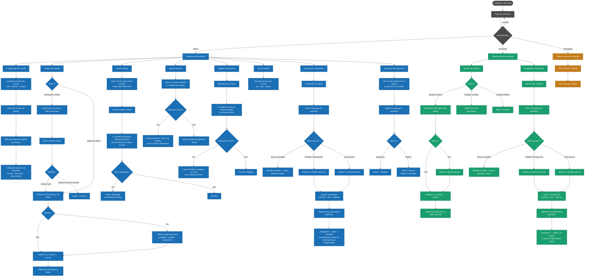

```mermaid
flowchart TD
    START([Utilisateur visite l'app]) --> LOGIN[Page de connexion]
    LOGIN --> AUTH{Authentification}
    AUTH -->|Invalide| LOGIN
    AUTH -->|Admin| ADMIN_DASH[Tableau de bord Admin]
    AUTH -->|Secrétaire| SEC_DASH[Tableau de bord Secrétaire]
    AUTH -->|Enseignant| TEACHER_DASH[Tableau de bord Enseignant]

    %% ── FLUX ADMIN ───────────────────────────────────────────

    ADMIN_DASH --> A1[Configuration de l'école]
    ADMIN_DASH --> A2[Gestion des élèves]
    ADMIN_DASH --> A3[Année scolaire]
    ADMIN_DASH --> A4[Aperçu financier]
    ADMIN_DASH --> A5[Rappels de paiement]
    ADMIN_DASH --> A6[Journal d'audit]

    A1 --> A1a[Configurer le profil de l'école\nnom · adresse · contact]
    A1a --> A1b[Créer les niveaux et classes]
    A1b --> A1c[Définir les frais de scolarité par niveau]
    A1c --> A1d[Configurer les plans de paiement\nannuel · semestriel · personnalisé]

    A2 --> A2a{Action ?}
    A2a -->|Rechercher / Filtrer| A2b[Rechercher par nom ou filtrer par niveau]
    A2b --> A2c[Voir le profil de l'élève]
    A2a -->|Ajouter un élève| A2d[Remplir les informations de l'élève]
    A2d --> A2e{Bourse ?}
    A2e -->|Non| A2f[Affecter à un niveau → inscrire]
    A2e -->|Oui| A2g[Définir le type de bourse\ncomplète · partielle · montant fixe]
    A2g --> A2f
    A2f --> A2h[Téléverser documents & photo]

    A2c --> A2i{Modifier ?}
    A2i -->|Mettre à jour| A2d
    A2i -->|Marquer comme transfert| A2j[Statut = transfert]

    A3 --> A3a[Créer une nouvelle année scolaire\ndéfinir date début & fin]
    A3a --> A3b[Activer l'année scolaire]
    A3b --> A3c[Le système fait passer automatiquement\ntous les élèves au niveau suivant]
    A3c --> A3d{Élève redoublant ?}
    A3d -->|Oui| A3e[Admin rétrograde\nmanuellement l'élève]
    A3d -->|Non| A3f[Terminé]

    A4 --> A4a[Voir les revenus collectés\nvs restants par niveau]
    A4a --> A4b{Filtrer par niveau ?}
    A4b -->|Oui| A4c[Revenus perçus · Revenus restants\npour le niveau sélectionné]
    A4b -->|Non| A4d[Résumé financier global de l'école]

    A5 --> A5a[Sélectionner un élève]
    A5a --> A5b[Le système envoie un email de rappel\nau contact parent]
    A5b --> A5c{Paiement en retard ?}
    A5c -->|Oui| A5d[Ligne de l'élève surlignée en rouge\nsur le tableau de bord]
    A5c -->|Non| A5e[Pas de surlignage]

    A6 --> A6a[Voir tous les journaux d'audit\nqui · quoi · quand]

    ADMIN_DASH --> A7[Enregistrer un paiement]
    ADMIN_DASH --> A8[Approuver les paiements]

    A7 --> A7a[Rechercher un élève]
    A7a --> A7b[Ouvrir l'historique de paiement]
    A7b --> A7c{Élève boursier ?}
    A7c -->|Bourse complète| A7d[Afficher Exempté — aucun paiement requis]
    A7c -->|Partielle / Montant fixe| A7e[Afficher le montant réduit dû]
    A7c -->|Sans bourse| A7f[Afficher le montant total dû]
    A7e --> A7g[Ajouter un paiement\nmontant · date · méthode]
    A7f --> A7g
    A7g --> A7h[Téléverser le justificatif de paiement]
    A7h --> A7i[Enregistrer — statut = complété\nles paiements admin ne nécessitent pas d'approbation]

    A8 --> A8a[Voir tous les paiements en attente\nsoumis par la secrétaire]
    A8a --> A8b[Vérifier le paiement + justificatif]
    A8b --> A8c{Décision ?}
    A8c -->|Approuver| A8d[Statut = complété]
    A8c -->|Rejeter| A8e[Statut = échoué\nnotifier la secrétaire]

    %% ── FLUX SECRÉTAIRE ──────────────────────────────────────

    SEC_DASH --> S1[Gestion des élèves]
    SEC_DASH --> S2[Enregistrer un paiement]

    S1 --> S1a{Action ?}
    S1a -->|Ajouter un élève| S1b[Remplir les informations de l'élève]
    S1b --> S1c{Bourse ?}
    S1c -->|Non| S1d[Affecter à un niveau → inscrire]
    S1c -->|Oui| S1e[Définir le type de bourse]
    S1e --> S1d
    S1d --> S1f[Téléverser documents & photo de profil]
    S1a -->|Modifier un élève| S1g[Mettre à jour les informations]
    S1a -->|Transfert d'élève| S1h[Statut = transfert]

    S2 --> S2a[Rechercher un élève]
    S2a --> S2b[Ouvrir l'historique de paiement]
    S2b --> S2c{Élève boursier ?}
    S2c -->|Bourse complète| S2d[Afficher Exempté — aucun paiement requis]
    S2c -->|Partielle / Montant fixe| S2e[Afficher le montant réduit dû]
    S2c -->|Sans bourse| S2f[Afficher le montant total dû]
    S2e --> S2g[Ajouter un paiement\nmontant · date · méthode]
    S2f --> S2g
    S2g --> S2h[Téléverser le justificatif de paiement]
    S2h --> S2i[Enregistrer — statut = en attente\nen attente d'approbation admin]

    %% ── FLUX ENSEIGNANT ──────────────────────────────────────

    TEACHER_DASH --> T1[Voir la classe assignée]
    T1 --> T2[Voir la liste des élèves]

    %% ── COULEURS ─────────────────────────────────────────────

    classDef shared    fill:#4a4a4a,stroke:#222,color:#fff
    classDef admin     fill:#1a6fb5,stroke:#0d4a80,color:#fff
    classDef secretary fill:#1a9e6e,stroke:#0d6b4a,color:#fff
    classDef teacher   fill:#c47c1a,stroke:#8a5510,color:#fff

    class START,LOGIN,AUTH shared

    class ADMIN_DASH,A1,A1a,A1b,A1c,A1d admin
    class A2,A2a,A2b,A2c,A2d,A2e,A2f,A2g,A2h,A2i,A2j admin
    class A3,A3a,A3b,A3c,A3d,A3e,A3f admin
    class A4,A4a,A4b,A4c,A4d admin
    class A5,A5a,A5b,A5c,A5d,A5e admin
    class A6,A6a admin
    class A7,A7a,A7b,A7c,A7d,A7e,A7f,A7g,A7h,A7i admin
    class A8,A8a,A8b,A8c,A8d,A8e admin

    class SEC_DASH,S1,S1a,S1b,S1c,S1d,S1e,S1f,S1g,S1h secretary
    class S2,S2a,S2b,S2c,S2d,S2e,S2f,S2g,S2h,S2i secretary

    class TEACHER_DASH,T1,T2 teacher
```
